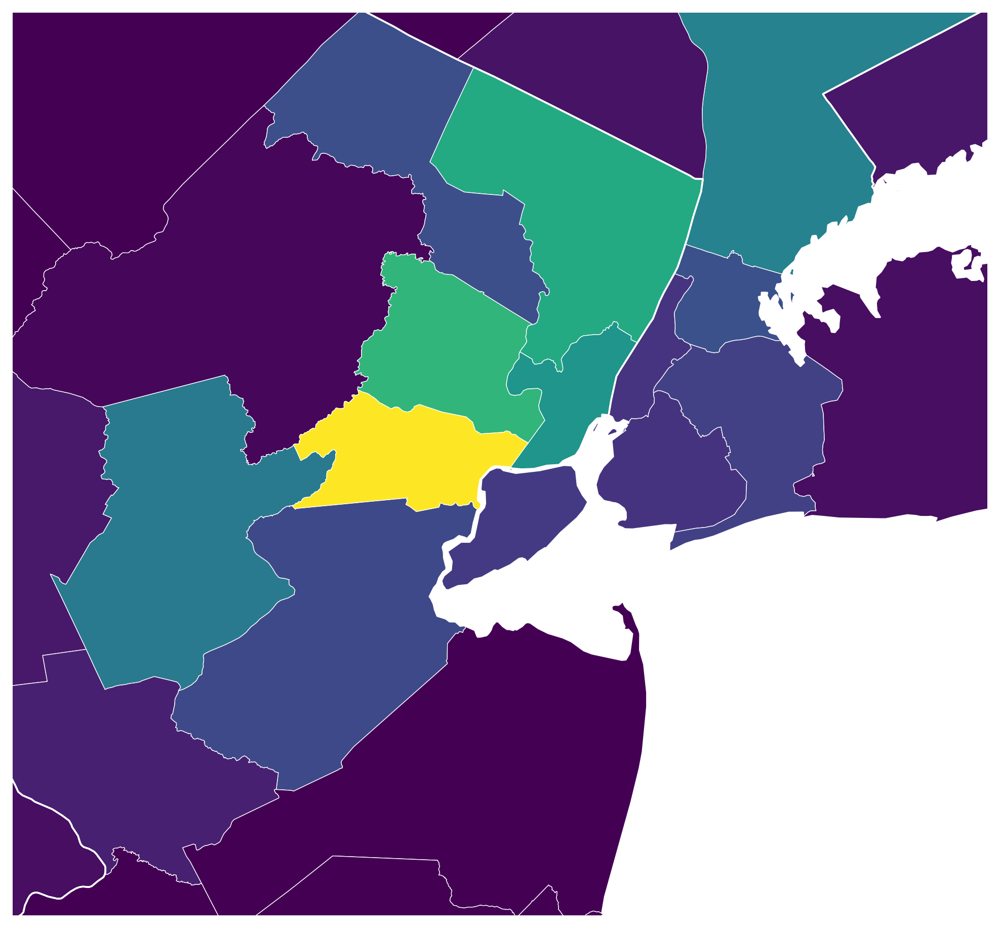

# Analyzing FEMA's National Flood Insurance Program (NFIP) Data With DuckDB
Author: Mark Bauer

  
*NFIP claims ($) related to Hurricane Ida by county, normalized by county area. Yellow indicates higher claims, purple indicates lower.*

# 1. Introduction
I've been enjoying DuckDB for the past few weeks, particularly how smooth the Python API feels. With its impressive speed and friendly SQL interface, analyzing moderately large data sets within a Jupyter Notebook are almost effortless. This project aims to demonstrate just how excited I am to use and to learn more about this incredible tool.

# 2. Notebook
Explore how DuckDB can query 2.6M rows and 70 columns within a Jupyter Notebook in seconds: [analysis.ipynb](https://github.com/mebauer/duckdb-fema-nfip/blob/main/analysis.ipynb).

# 3. Data
**OpenFEMA Dataset: FIMA NFIP Redacted Claims - v2**  
The analysis presented here is solely focused on the [FIMA NFIP Redacted Claims](https://www.fema.gov/openfema-data-page/fima-nfip-redacted-claims-v2) dataset, which fortunately is available in Parquet format. Given the substantial size of this dataset, it provided an opportunity to explore and utilize [DuckDB](https://duckdb.org/), a high-performance analytical database. While this guide offers valuable insights, users are encouraged to supplement their understanding by referring to the [official documentation](https://duckdb.org/docs/) provided on DuckDB's website.

This dataset constitutes a valuable resource containing extensive information related to [National Flood Insurance Program (NFIP)](https://www.floodsmart.gov/about) claims. The NFIP website offers a wealth of data resources, including visualizations, tables, and reports, under the [Flood Insurance Data and Analytics](https://nfipservices.floodsmart.gov/reports-flood-insurance-data) section. This project draws inspiration from these resources, particularly leveraging data from the *Financial Losses by State and Policy*, and *Loss Statistics by Flood Zone* Excel files.

**Dataset Citation:**  
OpenFEMA Dataset: FIMA NFIP Redacted Claims - v2. Retrieved from https://www.fema.gov/openfema-data-page/fima-nfip-redacted-claims-v2 on May 9, 2024, 16:02 EST. This product uses the FEMA OpenFEMA API, but is not endorsed by FEMA. The Federal Government or FEMA cannot vouch for the data or analyses derived from these data after the data have been retrieved from the Agency's website(s).

**OpenFEMA Terms and Conditions:**    
Please refer to the [OpenFEMA Terms and Conditions](https://www.fema.gov/about/openfema/terms-conditions) for further information regarding the usage and access of OpenFEMA datasets.

# 4. Additional Resources
- Official DuckDB Documentation: https://duckdb.org/
- DuckDB Python client guide: https://duckdb.org/docs/api/python/overview
- OpenFEMA: https://www.fema.gov/about/reports-and-data/openfema
- OpenFEMA Dataset: FIMA NFIP Redacted Claims - v2: https://www.fema.gov/openfema-data-page/fima-nfip-redacted-claims-v2

# 5. Say Hello!
Feel free to reach out.
- LinkedIn: [markebauer](https://www.linkedin.com/in/markebauer/)  
- GitHub: [mebauer](https://github.com/mebauer)  
- Portfolio: [mebauer.github.io](https://mebauer.github.io/)
